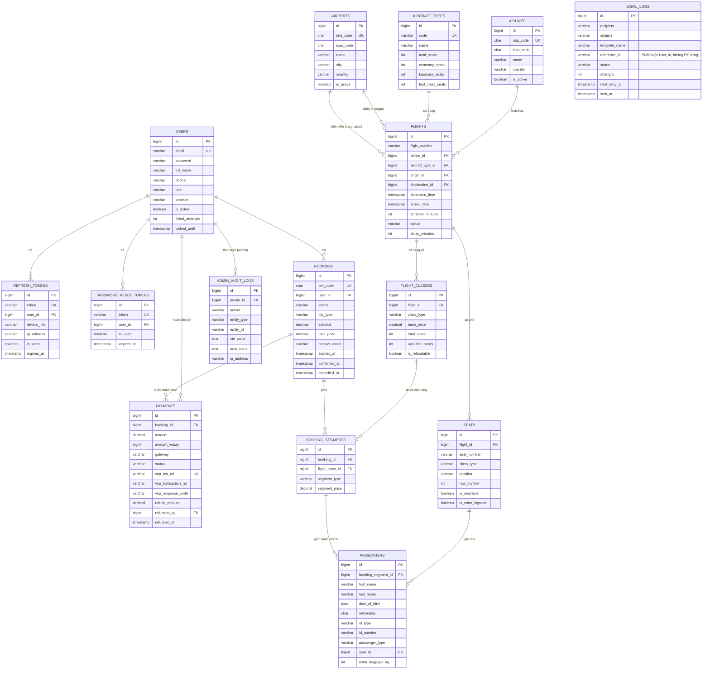

# FlightEasy — Sơ đồ quan hệ giữa các bảng (ERD)

> Tổng hợp từ toàn bộ 8 module: Auth, Flight Management, Flight Search, Booking & Seat, Payment (VNPay), Email Notification, Admin Dashboard, Token Blacklist.

---

## Giải thích quan hệ chính

### 1. Nhóm Auth (Service 01, 08)
- `users` 1—n `refresh_tokens`: mỗi user có nhiều refresh token (theo thiết bị/phiên đăng nhập).
- `users` 1—n `password_reset_tokens`: token quên mật khẩu.
- **Token Blacklist** (Service 08) không có bảng riêng — dùng Redis (key `blacklist:token:<accessToken>`), không thuộc quan hệ DB quan hệ.

### 2. Nhóm Flight Management (Service 02, 03)
- `airlines`, `aircraft_types`, `airports` là bảng danh mục (master data).
- `flights` tham chiếu tới cả 4 bảng trên: `airline_id`, `aircraft_type_id`, `origin_id` và `destination_id` (2 FK cùng trỏ về `airports`).
- `flights` 1—n `flight_classes` (mỗi chuyến bay có nhiều hạng vé: Economy/Business/First).
- `flights` 1—n `seats` (sơ đồ ghế của từng chuyến bay).

### 3. Nhóm Booking & Seat (Service 04)
- `bookings` 1—n `booking_segments` (một booking có thể gồm chặng đi + chặng về — khứ hồi).
- `booking_segments` n—1 `flight_classes` (mỗi segment gắn với 1 hạng vé của 1 chuyến bay cụ thể).
- `booking_segments` 1—n `passengers` (nhiều hành khách trong cùng 1 segment).
- `passengers` n—1 `seats` (mỗi hành khách được gán 1 ghế, trừ hành khách INFANT có thể NULL).

### 4. Nhóm Payment (Service 05)
- `bookings` 1—n `payments` (có thể có nhiều lần thử thanh toán, nhưng chỉ 1 `PENDING` tại một thời điểm — theo fix trùng lặp gần đây).
- `payments.refunded_by` → `users.id` (admin thực hiện hoàn tiền).

### 5. Nhóm Email (Service 06)
- `email_logs` **không có FK cứng** — `reference_id` là chuỗi tự do (PNR code hoặc user ID) để linh hoạt log cho nhiều loại sự kiện (xác nhận booking, nhắc check-in...).

### 6. Nhóm Admin (Service 07)
- `admin_audit_logs.admin_id` → `users.id`: ghi lại hành động của admin (dùng AOP `@AfterReturning` tự động log).
- Ngoài ra còn 2 **view** tổng hợp không phải bảng gốc:
  - `daily_revenue` (materialized view) — tổng hợp doanh thu theo ngày từ `bookings`.
  - `revenue_by_route` (view) — join `bookings → booking_segments → flight_classes → flights → airports/airlines`.

---

## Tổng hợp Foreign Key

| Bảng | Cột FK | Tham chiếu tới |
|---|---|---|
| refresh_tokens | user_id | users.id |
| password_reset_tokens | user_id | users.id |
| flights | airline_id | airlines.id |
| flights | aircraft_type_id | aircraft_types.id |
| flights | origin_id | airports.id |
| flights | destination_id | airports.id |
| flight_classes | flight_id | flights.id |
| seats | flight_id | flights.id |
| bookings | user_id | users.id |
| booking_segments | booking_id | bookings.id |
| booking_segments | flight_class_id | flight_classes.id |
| passengers | booking_segment_id | booking_segments.id |
| passengers | seat_id | seats.id |
| payments | booking_id | bookings.id |
| payments | refunded_by | users.id |
| admin_audit_logs | admin_id | users.id |
